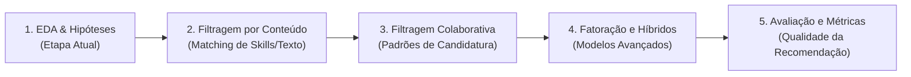

# PRD - Sistema de Recomendação de Vagas de Emprego (LinkedIn)

---

## 1. Visão Geral do Projeto

* **Disciplina:** Tópicos em Sistemas de Recomendação (UNITINS)
* **Área Temática:** Redes Profissionais (Vagas, Habilidades e Mercado de Trabalho)
* **Objetivo Geral:** Construir ao longo do semestre um **Sistema de Recomendação de Vagas de Emprego e Habilidades Profissionais**, utilizando dados reais da plataforma LinkedIn.
* **Foco da Etapa Atual (Aula 02):** Realizar uma **Análise Exploratória de Dados (EDA)** rigorosa e intuitiva, testando hipóteses confirmatórias e contra-intuitivas do mercado de trabalho para guiar as futuras decisões do recomendador.

---

## 2. Dataset Escolhido

* **Nome:** *LinkedIn Job Postings (2023 - 2024)*
* **Fonte:** Kaggle (`arshkon/linkedin-job-postings`)
* **Principais Tabelas e Informações Utilizadas:**
  * **`postings.csv`:** `job_id`, `company_id`, `title`, `remote_allowed`, `formatted_experience_level`, `normalized_salary`, `med_salary`, `views`, `applies`.
  * **`companies/companies.csv`:** `company_id`, `name`, `company_size` (Porte da empresa de 1 a 7).
  * **`jobs/job_skills.csv` & `mappings/skills.csv`:** Relação e mapeamento de competências exigidas.

---

## 3. Hipóteses e Perguntas da EDA (Etapa Atual)

A análise exploratória avalia 5 hipóteses estratégicas (3 confirmatórias e 2 contra-intuitivas):

1. **Hipótese 1 ($H_1$) -- Preferência por Trabalho Remoto (Confirmada):**
   * *Pergunta:* As pessoas se candidatam mais para vagas remotas do que para vagas presenciais?
   * *Hipótese:* Vagas na modalidade remota recebem, em média, significativamente mais candidaturas (`applies`) por vaga do que vagas presenciais/híbridas.
   * *Achado:* Vagas remotas recebem ~3× mais candidaturas (média 20,8 vs. 6,7; mediana 6,0 vs. 2,0).

2. **Hipótese 2 ($H_2$) -- Relação entre Experiência e Salário (Confirmada):**
   * *Pergunta:* Quanto o salário médio aumenta conforme o nível de senioridade exigido?
   * *Hipótese:* Vagas de nível Sênior oferecem uma média salarial superior ao dobro de vagas de nível Júnior/Entrada.
   * *Achado:* **Mediana** salarial de Sênior (\$107.500) supera o dobro de Júnior (\$52.213) — razão 2,06×. As médias brutas são contaminadas por outliers extremos (ex.: estágios com média \$963 mil), por isso a comparação de referência usa medianas.

3. **Hipótese 3 ($H_3$) -- Salário: Remoto vs. Presencial (Refutada / Contra-Intuitiva):**
   * *Pergunta:* Vagas presenciais pagam mais para compensar custos de deslocamento e moradia?
   * *Hipótese de Senso Comum:* Vagas presenciais oferecem remuneração média superior às vagas remotas.
   * *Achado:* **Refutada.** Vagas remotas pagam **45% a mais em mediana** (\$112.500 vs. \$77.500) devido à concorrência por talentos em escala nacional/global.

4. **Hipótese 4 ($H_4$) -- Porte da Empresa vs. Salário (Refutada / Contra-Intuitiva):**
   * *Pergunta:* Megacorporações multinacionais pagam os maiores salários médios do mercado?
   * *Hipótese de Senso Comum:* Quanto maior o porte da empresa (`company_size`), maior é a remuneração média oferecida.
   * *Achado:* **Refutada.** Empresas de médio porte e startups de tecnologia (Porte 2 a 3) apresentam salários medianos superiores (\$90.000 vs. \$73.840 nas gigantes de Porte 7), pois grandes corporações possuem contingente massivo de cargos operacionais.

5. **Hipótese 5 ($H_5$) -- Fatores Determinantes da Transparência Salarial (Confirmada):**
   * *Pergunta:* Vagas remotas e níveis plenos/corporativos divulgam mais o salário do que vagas presenciais ou cargos de entrada?
   * *Hipótese:* Vagas remotas (31,90% vs. 28,74%) e posições de nível Pleno/Associate (39,60%) e Diretoria (33,85%) apresentam maior taxa de transparência salarial (`is_salary_disclosed`) do que vagas de nível júnior/estágio (24,86%).
   * *Achado:* **Confirmada.** O trabalho remoto e cargos com maior competitividade de contratação abrem o salário com maior frequência para atrair candidatos qualificados.

---

## 4. Estrutura do Relatório de EDA (`estrutura-eda.md`)

A entrega do relatório segue os 9 tópicos obrigatórios:

| Seção | Conteúdo |
| :--- | :--- |
| **1. Capa** | Título do trabalho, identificação da disciplina (UNITINS), autor e data. |
| **2. Sumário** | Índice navegável das seções do documento. |
| **3. Introdução** | Contextualização de Redes Profissionais, objetivo da EDA e apresentação das 4 hipóteses ($H_1$ a $H_4$). |
| **4. Metodologia** | Origem dos dados do LinkedIn, ferramentas utilizadas (Python, Pandas, Seaborn/Matplotlib) e processo de limpeza. |
| **5. Resultados** | Tabelas resumo e Gráficos explicativos para cada uma das 4 hipóteses. |
| **6. Discussão / Insights** | O que os resultados significam para o usuário e como calibrar os pesos e filtros do Sistema de Recomendação. |
| **7. Limitações** | Conformidade estrita com a **LGPD** (dados corporativos públicos) e limitações de preenchimento salarial. |
| **8. Conclusão** | Síntese dos aprendizados obtidos com a exploração dos dados. |
| **9. Referências / Anexos** | Referências bibliográficas e código Python documentado em anexo. |

---

## 5. Roteiro para as Próximas Etapas da Pipeline (Semestre)

