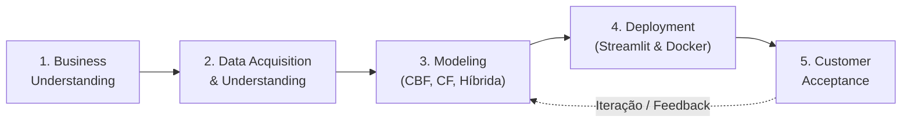

# 📐 Etapa 1: Metodologia TDSP (Team Data Science Process)

> **Documento de Orientação para o Mega Documento**  
> **Tema:** Metodologia TDSP aplicada ao Sistema de Recomendação de Vagas  
> **Finalidade:** Orientar a equipe sobre o que redigir, como justificar as escolhas metodológicas e como estruturar o capítulo de governança de dados e software.

---

## 1. O que é o TDSP e por que a Disciplina exige essa Metodologia?

O **Team Data Science Process (TDSP)** é uma metodologia ágil e iterativa de Ciência de Dados desenvolvida pela Microsoft. Ela une os princípios de **Machine Learning / Data Science** às práticas consolidadas da **Engenharia de Software** e gerenciamento de projetos ágeis.

### Por que adotar o TDSP neste projeto?
* **Ponte entre Ciência e Gestão:** Conforme anotado nas aulas (`Aula 04-09.md` e `Aula 11-09.md`), um sistema de recomendação corporativo não pode ser apenas um script isolado em um notebook. Ele exige interpretabilidade para a área de negócios e governança de software.
* **Sustentação de Sistema Legado (*Legacy System*):** A metodologia garante que qualquer novo desenvolvedor ou cientista de dados que ingresse na equipe consiga compreender, reproduzir, auditar e evoluir o sistema sem depender do autor original.
* **Ciclo de Vida Estruturado:** Evita que a equipe salte para a modelagem sem compreender o mercado ou implante modelos sem validação contra baselines.

---

## 2. As 5 Fases do TDSP Aplicadas ao Projeto

No Mega Documento, este capítulo deve descrever detalhadamente como o nosso projeto transitou por cada uma das 5 etapas do ciclo de vida do TDSP:

### 🔹 Fase 1: Entendimento do Negócio (*Business Understanding*)
* **Definição do Problema:** Sobrecarga de dados (*information overload*) no mercado de trabalho. Candidatos gastam horas filtrando vagas incompatíveis e recrutadores recebem volumes massivos de aplicações não qualificadas.
* **Objetivo Geral:** Desenvolver uma plataforma inteligente de recomendação que apresente oportunidades profissionais personalizadas.
* **Critérios de Sucesso de Negócio:** 
  * Aumentar o alinhamento das candidaturas (relevância);
  * Reduzir o tempo de busca do candidato;
  * Fornecer métricas transparentes e auditáveis para os tomadores de decisão.

### 🔹 Fase 2: Aquisição e Entendimento dos Dados (*Data Acquisition & Understanding*)
* **Fonte de Dados:** Dataset público do LinkedIn (Kaggle: `arshkon/linkedin-job-postings`), cobrindo 2023–2024 com 123.849 postagens de vagas corporativas.
* **Ingestão e Tratamento:** Tratamento de valores ausentes (imputação de nível de experiência, porte de empresa e categorização salarial em `de_para_nulos.ipynb`).
* **Análise Exploratória (EDA):** Formulação e teste estatístico de 5 hipóteses estratégicas (compreensão das dinâmicas de mercado antes da modelagem).

### 🔹 Fase 3: Modelagem (*Modeling*)
* **Engenharia de Recursos (*Feature Engineering*):** 
  * Construção do identificador composto textual: $(\text{Título} \times 2) + \text{Skills} + \text{Senioridade}$.
  * Cálculo da taxa de atratividade empírica (CTR) como atributo de desempate.
* **Desenvolvimento e Treinamento de Modelos:**
  * *Filtragem Baseada em Conteúdo (CBF):* Matriz TF-IDF (3.000 termos) e similaridade de cosseno.
  * *Filtragem Colaborativa (CF):* Simulação estocástica de interações e comparação rigorosa entre SVD e KNN.
  * *Filtragem Híbrida:* Fusão ponderada das abordagens.
* **Avaliação e Auditoria de Métricas:** Medição em conjunto de teste segregado (120k ratings), confrontação contra baselines triviais (média global, usuário, item) e teste pareado de Wilcoxon.

### 🔹 Fase 4: Implantação (*Deployment*)
* **Interface do Usuário:** Dashboard interativo em Streamlit (`app/dashboard.py`) organizado em abas temáticas.
* **Infraestrutura e Empacotamento:** Conteinerização com `Dockerfile` para execução isolada e reprodutível.
* **Camada de Cache e Desempenho:** Armazenamento intermediário em cache (`catalogo_cf.csv` e `modelo_svd.pkl`) para inicialização rápida sem reprocessar matrizes pesadas.

### 🔹 Fase 5: Aceitação do Cliente (*Customer Acceptance*)
* **Validação das User Stories:** Demonstração prática de que cada história de usuário (Candidato, Recrutador e Avaliador) é satisfeita na interface.
* **Painel de Explicabilidade:** Decomposição transparente dos fatores do SVD ($\mu + b_u + b_i + q_i^T p_u$) para eliminar a percepção de "caixa-preta".
* **Relatório e Guia de Apresentação:** Documentação clara para que partes não técnicas compreendam o retorno do investimento e as decisões de design.

---

## 3. Governança, Papéis e Rastreabilidade de Artefatos

O TDSP preconiza a padronização e rastreabilidade dos ativos gerados. O Mega Documento deve incluir esta tabela estrutural:

| Camada TDSP | Artefatos no Repositório | Responsabilidade / Função |
| :--- | :--- | :--- |
| **Documentação & Decisões** | `PRD.md`, `DECISOES.md`, `AUDITORIA_METRICAS.md` | Registro de requisitos, justificativa de design e auditoria de números. |
| **Exploração & Prototipagem** | `notebooks/*.ipynb` | Experimentação controlada, visualizações e formulações preliminares. |
| **Código Produtivo / Lógica** | `src/*.py` | Módulos reutilizáveis de CBF, CF, geração sintética e cálculo de métricas. |
| **Dados & Modelos Salvos** | `data/raw/`, `data/processed/`, `*.pkl` | Dados brutos, catálogos indexados e pesos treinados dos modelos. |
| **Apresentação / Produto** | `app/dashboard.py` | Entrega de valor para o usuário final via Streamlit. |

---

## 4. O que a Equipe deve Escrever nesta Seção do Relatório

Ao redigir o capítulo de TDSP no documento final, a equipe deve focar em:
1. **Contextualizar a metodologia:** Explicar que a ciência de dados foi orientada a processos organizados, e não a execuções ad-hoc.
2. **Descrever as 5 fases:** Resumir as ações concretas executadas pelo grupo em cada fase, utilizando o diagrama Mermaid acima.
3. **Destacar a rastreabilidade:** Deixar explícito que nada no projeto foi "chutado" ou hardcoded — cada métrica e visualização é rastreável até os dados brutos e scripts de treinamento.
