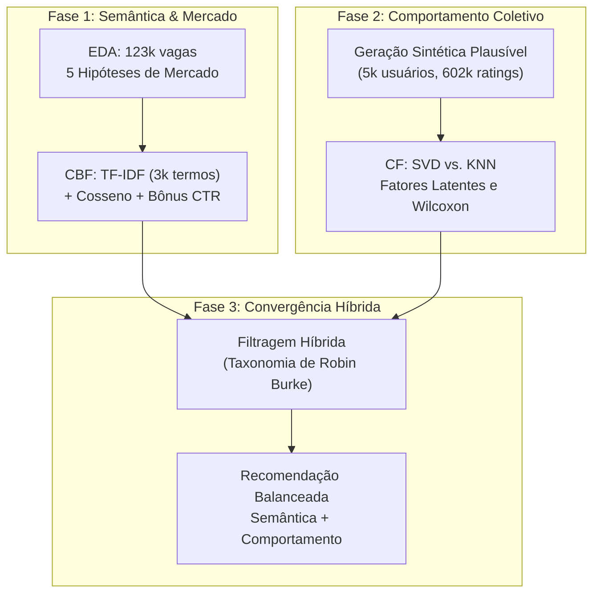

# 🚀 Etapa 2: Fases do Projeto (Fase 1, Fase 2 e Fase 3)

> **Documento de Orientação para o Mega Documento**  
> **Tema:** Detalhamento das Fases do Projeto e Evolução Algorítmica  
> **Finalidade:** Orientar a redação sobre as 3 fases do projeto, explicando os algoritmos, a matemática subjacente, as decisões técnicas e a transição até a Filtragem Híbrida.

---

## 🧭 Visão Geral da Linha do Tempo

O projeto foi dividido em três grandes fases pedagógicas e técnicas ao longo do semestre:

---

## 1. Fase 1: EDA + Filtragem Baseada em Conteúdo (CBF)

### 1.1 Análise Exploratória de Dados (EDA)
Antes de construir qualquer recomendador, foi fundamental conhecer a distribuição real do mercado de vagas de tecnologia e redes profissionais (123.849 vagas reais do LinkedIn).
* **As 5 Hipóteses Avaliadas:**
  1. **$H_1$ (Atratividade Remota - Confirmada):** Vagas remotas recebem mais que o dobro de candidaturas (CTR mediano sobe de 16,5% para 20,6%).
  2. **$H_2$ (Salário vs. Senioridade - Confirmada):** Vagas de nível Sênior oferecem mais que o dobro do salário mediano de vagas de entrada/júnior ($107.500 vs. $52.200).
  3. **$H_3$ (Salário Remoto vs. Presencial - Refutada / Contra-intuitiva):** Vagas presenciais não pagam mais para compensar transporte; na verdade, posições remotas pagam 45% a mais em mediana ($112.500 vs. $77.500) devido à concorrência global por talentos.
  4. **$H_4$ (Porte da Empresa vs. Salário - Refutada / Contra-intuitiva):** Empresas gigantes não lideram o topo salarial mediano; empresas médias e scale-ups de tecnologia apresentam remunerações medianas superiores ($90.000 vs. $73.840 nas megacorporações com muitos cargos operacionais).
  5. **$H_5$ (Transparência Salarial - Confirmada):** Vagas remotas e de média/alta senioridade divulgam o salário com maior frequência para acelerar o processo de atração.

### 1.2 Filtragem Baseada em Conteúdo (CBF)
* **Conceito:** Recomenda itens semelhantes àqueles pelos quais o usuário já demonstrou interesse, baseando-se estritamente nos atributos do item (texto, skills, senioridade).
* **Vetorização TF-IDF:** Converte texto livre em vetores numéricos ponderados pela presença local (TF) balanceada pela raridade global do termo (IDF).
* **Identificador Composto da Vaga:**
  $$\text{Texto} = (\text{Título} \times 2) + \text{Skills} + \text{Senioridade}$$
  * *Por que título vezes 2?* Evita que profissionais em transição recebam recomendações errôneas devido a habilidades genéricas ou secundárias.
* **Similaridade do Cosseno:**
  $$\cos(\vec{u}, \vec{v}) = \frac{\vec{u} \cdot \vec{v}}{\|\vec{u}\| \|\vec{v}\|}$$
  * Utilizada para avaliar a proximidade angular entre o vetor de perfil do candidato e os vetores das vagas, sem ser penalizada pela extensão do texto.
* **Critério de Desempate (CTR Empírico):** Incorporação da taxa empírica de conversão da EDA no score final ($\text{Score} = \text{Cosseno} + \alpha \cdot \text{CTR}$), valorizando vagas comprovadamente atraentes.

---

## 2. Fase 2: Filtragem Colaborativa (CF)

### 2.1 O Desafio dos Dados e a Solução Sintética
* **O Problema:** O LinkedIn não expõe o histórico de interações (notas e candidaturas) dos usuários por razões de privacidade e conformidade com a LGPD. Sem dados de interação usuário-item, é impossível treinar uma Filtragem Colaborativa.
* **A Solução:** Simulação estocástica de **5.000 usuários** sobre um catálogo estratificado de **6.000 vagas**, gerando **602.216 avaliações** com personas realistas.
* **Decisão Metodológica A3 (Exposição $\neq$ Opinião):**
  * *Exposição:* Quais vagas o usuário vê (85% guiada pela popularidade de mercado).
  * *Opinião:* Que nota ele dá ao que viu (100% guiada pela afinidade intrínseca com sua persona $+ \text{ruído}$ estocástico $\varepsilon \sim \mathcal{N}(0, 0,55)$).
  * Essa separação evitou que o treino contivesse apenas notas altas, criando avaliações negativas reais (notas 1 e 2) para os algoritmos aprenderem o que o usuário **rejeita**.

### 2.2 Confronto Algorítmico: SVD vs. KNN vs. Baselines
* **Baseado em Memória (KNN):** Busca vizinhos próximos via cosseno entre linhas de usuários. Sofreu severamente com a esparsidade de 97,99% (na versão inicial sem ajuste, 79,8% das previsões caíam em fallback).
* **Baseado em Modelo (SVD - Fatoração Matricial):** Decompõe a matriz de avaliações em matrizes de fatores latentes ($p_u \in \mathbb{R}^{20}$ e $q_i \in \mathbb{R}^{20}$), generalizando o comportamento mesmo em áreas esparsas.
* **Resultados Auditados:**
  * **RMSE:** SVD **0,625** vs. KNN **1,263** vs. Média Global **1,578** (SVD reduziu 60,4% do erro da média global, operando muito próximo do piso teórico de ruído de 0,520).
  * **Precision@10:** SVD **1,000** vs. KNN **0,874** vs. Popularidade **0,785** vs. Aleatório **0,352**.
  * **Significância Estatística:** Teste pareado de Wilcoxon sobre 119.828 pares com $p \approx 0$, comprovando a superioridade real do SVD.
* **Explicabilidade da Predição:**
  $$\hat{y} = \mu + b_u + b_i + q_i^T p_u$$
  (Média global $+$ viés do usuário $+$ viés da vaga $+$ casamento dos fatores latentes).

---

## 3. Fase 3: Filtragem Híbrida (A Próxima Etapa)

A Fase 3 encerra o ciclo de engenharia do projeto, unindo a semântica textual da Fase 1 à inteligência comportamental da Fase 2.

### 3.1 Por que Hibridizar?
* **A CBF isolada** sofre de hiperespecialização (bolha de filtro: se o candidato só curtiu "Data Scientist", nunca receberá uma vaga de "Machine Learning Engineer" com título diferente, mesmo que tenha afinidade).
* **A CF isolada** sofre de *cold start* catastrófico (se um usuário novo entrar no sistema ou uma vaga for postada hoje, ela tem 0 interações e não pode ser recomendada).

### 3.2 Taxonomia de Robin Burke Adotada
O projeto adota uma abordagem combinada baseada na taxonomia clássica de Burke (2002):

1. **Hibridização Ponderada (*Weighted*):**
   Para usuários com histórico conhecido, o score final é a média balanceada das predições normalizadas:
   $$\text{Score Híbrido} = w_{\text{cbf}} \cdot \text{Score}_{\text{CBF}} + w_{\text{cf}} \cdot \text{Score}_{\text{CF}}$$
   (Sugestão empírica: $w_{\text{cbf}} = 0,4$ e $w_{\text{cf}} = 0,6$).

2. **Chaveamento por Cold Start (*Switching*):**
   * Se $N_{\text{interações}} < 5 \implies$ Sistema opera em modo CBF puro (usa texto e skills informados na hora).
   * Se $N_{\text{interações}} \ge 5 \implies$ Sistema comuta automaticamente para a fórmula Ponderada.

---

## 4. O que a Equipe deve Escrever nesta Seção do Relatório

Ao redigir o capítulo das Fases do Projeto, siga este roteiro:
1. **Dedicar uma subseção para cada fase:** Explicar a motivação, os dados utilizados, as fórmulas aplicadas e os resultados obtidos.
2. **Explicar a matemática em português claro:** Usar as analogias consolidadas no `GUIA_APRESENTACAO.md` (ex.: fatores latentes como "DNA numérico de preferências").
3. **Justificar a necessidade da Fase 3:** Apresentar a tabela comparativa de trade-offs e defender tecnicamente por que a hibridização é a única solução completa para um ambiente de produção real.
