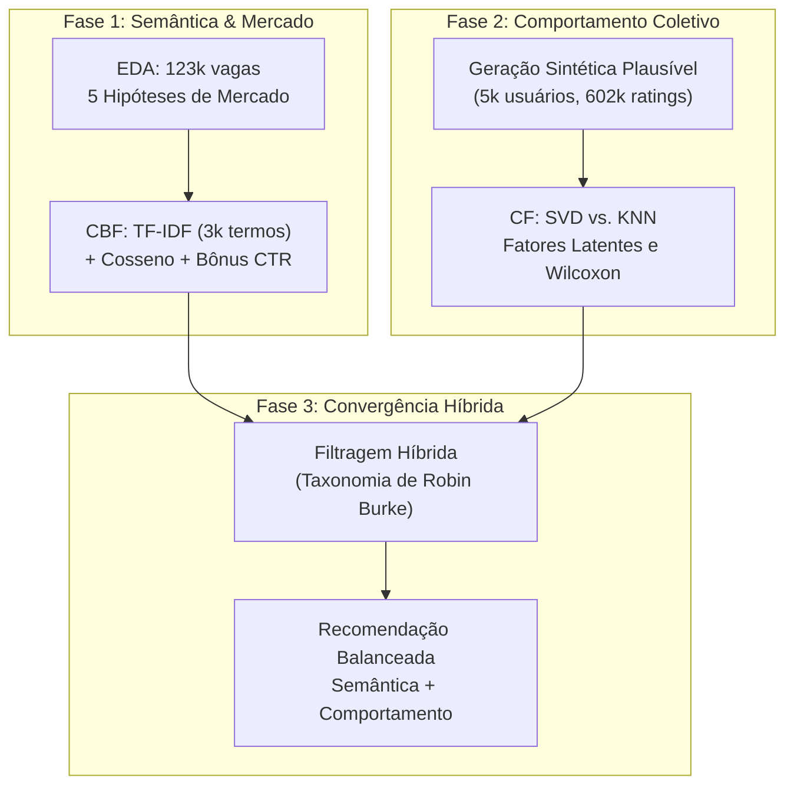
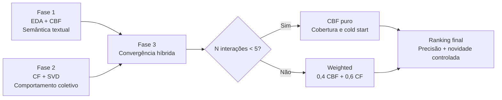

# 🚀 Etapa 2: Fases do Projeto (Fase 1, Fase 2 e Fase 3)

> **Documento de Orientação para o Mega Documento**  
> **Tema:** Detalhamento das Fases do Projeto e Evolução Algorítmica  
> **Finalidade:** Orientar a redação sobre as 3 fases do projeto, explicando os algoritmos, a matemática subjacente, as decisões técnicas e a transição até a Filtragem Híbrida.

---

## 🧭 Visão Geral da Linha do Tempo

O projeto foi dividido em três grandes fases pedagógicas e técnicas ao longo do semestre:

---

## 1. Fase 1: EDA + Filtragem Baseada em Conteúdo (CBF)

### 1.1 Análise Exploratória de Dados (EDA)
Antes de construir qualquer recomendador, foi fundamental conhecer a distribuição real do mercado de vagas de tecnologia e redes profissionais (123.849 vagas reais do LinkedIn).
* **As 5 Hipóteses Avaliadas:**
  1. **$H_1$ (Atratividade Remota - Confirmada):** Vagas remotas recebem mais que o dobro de candidaturas (CTR mediano sobe de 16,5% para 20,6%).
  2. **$H_2$ (Salário vs. Senioridade - Confirmada):** Vagas de nível Sênior oferecem mais que o dobro do salário mediano de vagas de entrada/júnior ($107.500 vs. $52.200).
  3. **$H_3$ (Salário Remoto vs. Presencial - Refutada / Contra-intuitiva):** Vagas presenciais não pagam mais para compensar transporte; na verdade, posições remotas pagam 45% a mais em mediana ($112.500 vs. $77.500) devido à concorrência global por talentos.
  4. **$H_4$ (Porte da Empresa vs. Salário - Refutada / Contra-intuitiva):** Empresas gigantes não lideram o topo salarial mediano; empresas médias e scale-ups de tecnologia apresentam remunerações medianas superiores ($90.000 vs. $73.840 nas megacorporações com muitos cargos operacionais).
  5. **$H_5$ (Transparência Salarial - Confirmada):** Vagas remotas e de média/alta senioridade divulgam o salário com maior frequência para acelerar o processo de atração.

### 1.2 Filtragem Baseada em Conteúdo (CBF)
* **Conceito:** Recomenda itens semelhantes àqueles pelos quais o usuário já demonstrou interesse, baseando-se estritamente nos atributos do item (texto, skills, senioridade).
* **Vetorização TF-IDF:** Converte texto livre em vetores numéricos ponderados pela presença local (TF) balanceada pela raridade global do termo (IDF).
* **Identificador Composto da Vaga:**
  $$\text{Texto} = (\text{Título} \times 2) + \text{Skills} + \text{Senioridade}$$
  * *Por que título vezes 2?* Evita que profissionais em transição recebam recomendações errôneas devido a habilidades genéricas ou secundárias.
* **Similaridade do Cosseno:**
  $$\cos(\vec{u}, \vec{v}) = \frac{\vec{u} \cdot \vec{v}}{\|\vec{u}\| \|\vec{v}\|}$$
  * Utilizada para avaliar a proximidade angular entre o vetor de perfil do candidato e os vetores das vagas, sem ser penalizada pela extensão do texto.
* **Critério de Desempate (CTR Empírico):** Incorporação da taxa empírica de conversão da EDA no score final ($\text{Score} = \text{Cosseno} + \alpha \cdot \text{CTR}$), valorizando vagas comprovadamente atraentes.

---

## 2. Fase 2: Filtragem Colaborativa (CF)

### 2.1 O Desafio dos Dados e a Solução Sintética
* **O Problema:** O LinkedIn não expõe o histórico de interações (notas e candidaturas) dos usuários por razões de privacidade e conformidade com a LGPD. Sem dados de interação usuário-item, é impossível treinar uma Filtragem Colaborativa.
* **A Solução:** Simulação estocástica de **5.000 usuários** sobre um catálogo estratificado de **6.000 vagas**, gerando **602.216 avaliações** com personas realistas.
* **Decisão Metodológica A3 (Exposição $\neq$ Opinião):**
  * *Exposição:* Quais vagas o usuário vê (85% guiada pela popularidade de mercado).
  * *Opinião:* Que nota ele dá ao que viu (100% guiada pela afinidade intrínseca com sua persona $+ \text{ruído}$ estocástico $\varepsilon \sim \mathcal{N}(0, 0,55)$).
  * Essa separação evitou que o treino contivesse apenas notas altas, criando avaliações negativas reais (notas 1 e 2) para os algoritmos aprenderem o que o usuário **rejeita**.

### 2.2 Confronto Algorítmico: SVD vs. KNN vs. Baselines
* **Baseado em Memória (KNN):** Busca vizinhos próximos via cosseno entre linhas de usuários. Sofreu severamente com a esparsidade de 97,99% (na versão inicial sem ajuste, 79,8% das previsões caíam em fallback).
* **Baseado em Modelo (SVD - Fatoração Matricial):** Decompõe a matriz de avaliações em matrizes de fatores latentes ($p_u \in \mathbb{R}^{20}$ e $q_i \in \mathbb{R}^{20}$), generalizando o comportamento mesmo em áreas esparsas.
* **Resultados Auditados:**
  * **RMSE:** SVD **0,625** vs. KNN **1,263** vs. Média Global **1,578** (SVD reduziu 60,4% do erro da média global, operando muito próximo do piso teórico de ruído de 0,520).
  * **Precision@10:** SVD **1,000** vs. KNN **0,874** vs. Popularidade **0,785** vs. Aleatório **0,352**.
  * **Significância Estatística:** Teste pareado de Wilcoxon sobre 119.828 pares com $p \approx 0$, comprovando a superioridade real do SVD.
* **Explicabilidade da Predição:**
  $$\hat{y} = \mu + b_u + b_i + q_i^T p_u$$
  (Média global $+$ viés do usuário $+$ viés da vaga $+$ casamento dos fatores latentes).

---

## 3. Fase 3: Filtragem Híbrida (A Próxima Etapa)

A Fase 3 encerra o ciclo de engenharia do projeto, unindo a semântica textual da Fase 1 à inteligência comportamental da Fase 2.

### 3.1 Por que Hibridizar?
Um sistema de produção precisa responder a dois sinais diferentes: o conteúdo da vaga e o comportamento agregado de candidatos semelhantes. A **CBF isolada** é forte quando há metadados e um perfil textual, mas tende à hiperespecialização: ao repetir apenas os atributos já conhecidos, pode criar uma bolha de filtro e deixar de apresentar uma vaga semanticamente próxima, porém expressa com outro título. A **CF isolada** captura relações coletivas e pode descobrir itens inesperados, mas depende de uma matriz de interações. Um usuário novo, uma vaga recém-publicada ou uma combinação ainda não observada produz pouca ou nenhuma evidência colaborativa.

Assim, a hibridização não é apenas uma média conveniente: ela combina duas fontes de sinal com falhas complementares. A CBF garante cobertura inicial e aderência profissional; a CF amplia a exploração com padrões coletivos e serendipidade controlada. Nas restrições deste projeto, em que o texto da vaga existe desde o primeiro instante e o histórico é gradual, essa combinação é a única das três alternativas avaliadas que oferece simultaneamente personalização imediata, adaptação comportamental e descoberta de itens.

| Estratégia | Ponto forte | Limitação estrutural | Consequência em produção |
| :--- | :--- | :--- | :--- |
| **CBF pura** | Funciona com texto, skills e senioridade disponíveis; explica a afinidade | Hiperespecialização e pouca novidade; não aprende tendências coletivas | Boa porta de entrada, mas pode estreitar o espaço de busca |
| **CF pura** | Aprende padrões coletivos, novidade e serendipidade | *Cold start* de usuários e itens; depende de histórico suficiente | Não consegue atender de forma confiável o primeiro acesso |
| **Híbrida** | Une cobertura semântica e comportamento coletivo | Exige calibração, normalização e governança dos pesos | Mantém um fallback imediato e evolui conforme surgem interações |

### 3.2 Taxonomia de Robin Burke Adotada
O projeto segue a taxonomia de sistemas híbridos de Burke (2002), combinando duas estratégias complementares: **ponderação (*weighted*)** para usuários com evidência colaborativa e **chaveamento (*switching*)** para o início do relacionamento com o sistema. O *switching* resolve a disponibilidade do sinal, enquanto o *weighted* resolve a integração dos sinais.

#### 3.2.1 Normalização e fusão ponderada (*Weighted*)

Os scores originais não são diretamente comparáveis. A CBF produz similaridade de cosseno, eventualmente modulada pelo CTR, enquanto a CF produz uma predição SVD na escala de ratings. Para cada vaga $i$ do conjunto candidato $C$, primeiro calculamos:

$$s^{\text{CBF}}_i = \operatorname{cos}(\vec{u},\vec{v}_i)\left(1+\alpha\,\operatorname{CTR}_i\right)$$

$$s^{\text{CF}}_i = \hat{y}_{u,i} = \mu+b_u+b_i+q_i^T p_u$$

Em seguida, cada vetor de scores é normalizado por *min-max* dentro do mesmo conjunto de candidatos:

$$\operatorname{norm}(s_i;C)=\frac{s_i-\min_{j\in C}(s_j)}{\max_{j\in C}(s_j)-\min_{j\in C}(s_j)}$$

Quando todos os itens recebem o mesmo score, o denominador é zero; nesse caso, definimos $\operatorname{norm}(s_i;C)=0,5$ para representar ausência de poder discriminativo, em vez de favorecer arbitrariamente uma vaga. Portanto:

$$S^{\text{CBF}}_i=\operatorname{norm}(s^{\text{CBF}}_i;C),\qquad S^{\text{CF}}_i=\operatorname{norm}(s^{\text{CF}}_i;C)$$

A fusão final é:

$$\boxed{S^{\text{Híbrido}}_i=0,4\,S^{\text{CBF}}_i+0,6\,S^{\text{CF}}_i}$$

Os pesos $w_{\text{cbf}}=0,4$ e $w_{\text{cf}}=0,6$ são uma decisão empírica do projeto. O peso maior da CF reflete o desempenho observado do SVD na Fase 2 e dá mais espaço à novidade comportamental; os $40\%$ da CBF preservam a coerência textual e a explicabilidade profissional. Como $w_{\text{cbf}}+w_{\text{cf}}=1$, o resultado permanece em $[0,1]$ e pode ser usado para ordenar o *ranking*. Os itens já vistos devem ser removidos antes da fusão, para que novidade não seja confundida com repetição.

#### 3.2.2 Chaveamento dinâmico (*Switching*) para *cold start*

O sistema escolhe a estratégia de acordo com a quantidade de interações válidas do usuário:

$$S_i(u)=\begin{cases}S^{\text{CBF}}_i, & N_{\text{interações}}(u)<5\\0,4\,S^{\text{CBF}}_i+0,6\,S^{\text{CF}}_i, & N_{\text{interações}}(u)\geq5\end{cases}$$

Com menos de cinco interações, o sistema opera em **CBF puro**, usando skills, senioridade, título e feedback disponível. Isso evita pedir ao modelo colaborativo uma inferência baseada em evidência insuficiente. Na quinta interação, o motor comuta automaticamente para a fusão ponderada; o usuário passa a contribuir com o próprio histórico e também se beneficia dos padrões coletivos. O limiar é uma política operacional, não uma propriedade matemática universal: deve ser reavaliado com validação temporal e métricas de ranking quando houver tráfego real.

O *switching* também estabelece o comportamento para itens novos: uma vaga sem histórico colaborativo continua elegível enquanto seus metadados permitirem cálculo de CBF. Caso um score colaborativo esteja ausente, a camada de decisão deve usar o componente CBF como fallback, registrando a ausência para monitoramento. Dessa forma, a entrada de vagas novas não paralisa o ranking.

### 3.3 Equilíbrio entre precisão e serendipidade

Precisão, neste contexto, significa ordenar vagas compatíveis com as competências e a senioridade desejadas. Serendipidade é revelar uma oportunidade relevante que não seria encontrada por simples repetição do histórico. A CBF protege a primeira propriedade; a CF acrescenta a segunda ao transferir padrões de usuários com trajetórias ou interesses parcialmente semelhantes.

O peso de $0,6$ não autoriza recomendações desconectadas do perfil: ele atua sobre scores já normalizados e é limitado pelo sinal semântico de $0,4$. A novidade é, portanto, controlada por uma restrição de elegibilidade profissional (skills, senioridade e filtros solicitados) e pela remoção de vagas já avaliadas. O resultado esperado é um ranking que preserve afinidade, mas escape da repetição literal de títulos e palavras-chave.

### 3.4 Referência da taxonomia

BURKE, R. **Hybrid recommender systems: Survey and experiments**. *User Modeling and User-Adapted Interaction*, v. 12, n. 4, p. 331--370, 2002. DOI: [10.1023/A:1021240730564](https://doi.org/10.1023/A:1021240730564).

---

## 4. O que a Equipe deve Escrever nesta Seção do Relatório

Ao redigir o capítulo das Fases do Projeto, siga este roteiro:
1. **Dedicar uma subseção para cada fase:** Explicar a motivação, os dados utilizados, as fórmulas aplicadas e os resultados obtidos.
2. **Explicar a matemática em português claro:** Usar as analogias consolidadas no `GUIA_APRESENTACAO.md` (ex.: fatores latentes como "DNA numérico de preferências").
3. **Justificar a necessidade da Fase 3:** Apresentar a tabela comparativa de trade-offs e defender tecnicamente por que a hibridização é a única solução completa para um ambiente de produção real.
