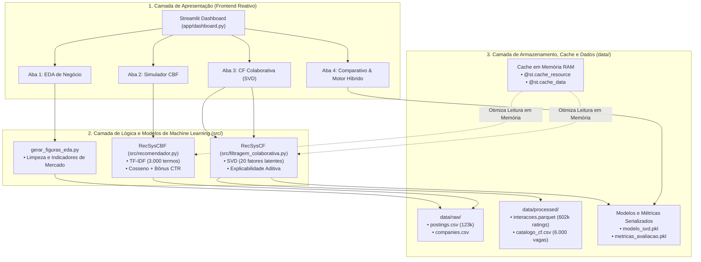
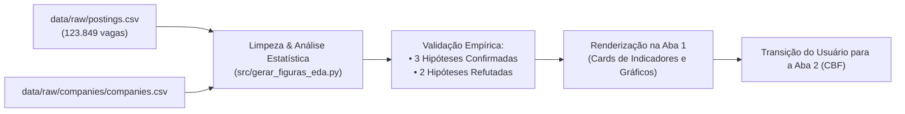
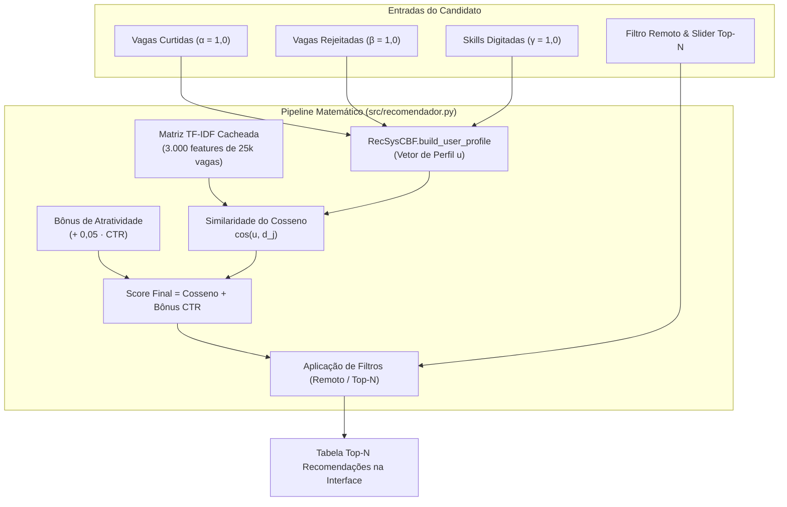
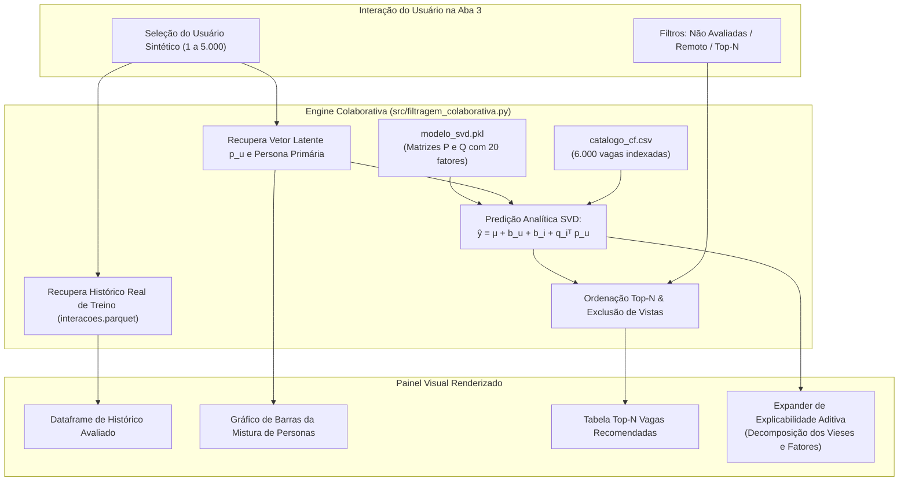
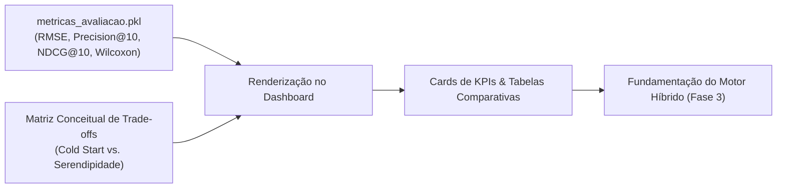
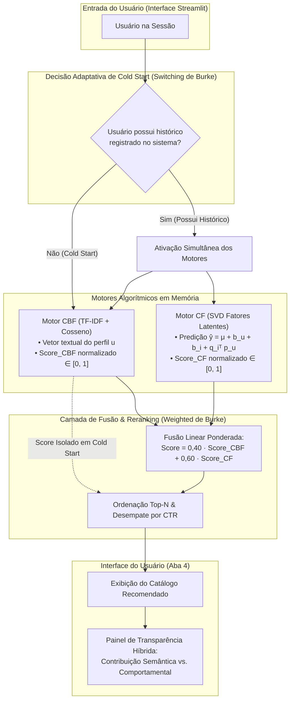

# 🏛️ Seção 2: Arquitetura Alvo e Fluxo por Aba do Sistema

> **Documento Oficial — Tópicos em Sistemas de Recomendação**  
> **Metodologia:** Team Data Science Process (TDSP)  
> **Vínculo com o Roteiro:** Item 2 do `instrucoes.md` / Issue #9  
> **Autor Designado:** Danilo Belém Oliveira (`@DaniloBelemOliveira`) | **Revisão:** Matheus Nardi  

---

## 1. Visão Geral da Arquitetura de Software e o Padrão "Fluxo por Aba"

A construção de um sistema de recomendação corporativo sustentável exige que a engenharia de software caminhe em estreita harmonia com a modelagem de Machine Learning. Seguindo os preceitos do **TDSP (Team Data Science Process)**, a aplicação desenvolvida neste projeto supera o paradigma de scripts exploratórios em *Jupyter Notebooks*, consolidando-se como um software com arquitetura modularizada, desacoplada e conteinerizada.

A solução é desenhada sobre um modelo em **3 Camadas Lógicas**, garantindo que as responsabilidades de interface, lógica algorítmica e persistência de artefatos sejam rigidamente isoladas:



### 1.1 O Conceito de "Fluxo por Aba" como Microssistemas Independentes

O framework **Streamlit** baseia-se em um modelo reativo de execução: a cada alteração em um widget (como mover um slider ou selecionar um item de um dropdown), o script principal [`app/dashboard.py`](file:///home/matheusn/dev/temp/topicosrecomendacao/app/dashboard.py) é reexecutado de cima para baixo (*rerun*).

Sob essa premissa, o conceito de **Fluxo por Aba** adotado no projeto estabelece que **cada aba do sistema atua como um microssistema independente**. Isso significa que cada aba possui seu próprio ciclo de vida fechado:
1. **Entrada de Parâmetros:** Captura do estado específico da interface gráfica do usuário;
2. **Computação e Transformação:** Execução de algoritmos locais, sem dependências colaterais de abas vizinhas;
3. **Renderização Visual:** Projeção isolada de gráficos, dataframes e métricas na tela.

Esse isolamento garante **sustentação e manutenibilidade para sistemas legados (*Legacy Systems*)**, viabilizando que cientistas de dados adicionem ou modifiquem algoritmos em uma aba (como o aprimoramento da decomposição SVD) sem qualquer risco de corromper os fluxos das demais.

---

## 2. Os 5 Componentes Estruturais Obrigatórios de Cada Aba

Para garantir conformidade arquitetural estrita entre todas as etapas do sistema, cada aba desenvolvida e documentada adota rigorosamente os seguintes **5 componentes obrigatórios**:

1. **Objetivo de Negócio & User Story Vinculada:** Identifica a hipótese econômica ou a pergunta de negócio que a aba responde, definindo com precisão a persona atendida (Candidato, Recrutador ou Avaliador Técnico).
2. **Entrada de Dados (Inputs e Artefatos de Base):** Especifica a origem dos dados (arquivos tabulares `.csv`, arquivos colunares `.parquet` ou modelos serializados `.pkl`) e os parâmetros que o usuário pode manipular em tempo real.
3. **Processamento / Pipeline Algorítmico:** Descreve a cadeia analítica e matemática percorrida pelos dados (ex.: cálculo de TF-IDF, similaridade de cosseno, inferência latente de fatores do SVD, agregações estatísticas).
4. **Saída Visual (Outputs e Elementos de Decisão):** Define o que é renderizado para o usuário, priorizando dataframes estilizados, cards informativos (*KPI cards*), gráficos interativos e painéis sanfonados de auditoria técnica.
5. **Comportamento sob Limitações, Fallback e Transição:** Especifica o tratamento de exceções do domínio de recomendação (especialmente o problema de *Cold Start* de novos usuários ou vagas raras) e orienta o usuário para o próximo estágio do sistema.

---

## 3. Mapeamento e Especificação Técnica das 4 Abas do Sistema

Abaixo é apresentada a engenharia detalhada das quatro abas implementadas no sistema:

---

### 📊 3.1 Aba 1: Visão de Negócio (EDA de Mercado)

* **1. Objetivo de Negócio & User Story:**
  * *Objetivo:* Apresentar os achados empíricos do mercado de trabalho de tecnologia, estabelecendo uma base de fatos quantitativos que validam as hipóteses estratégicas antes de propor algoritmos de recomendação.
  * *User Story:* *"Como candidato, quero ver estatísticas do mercado de vagas, para entender o contexto antes de buscar recomendações."* (Persona: Candidato).
* **2. Entradas de Dados & Artefatos:**
  * `data/raw/postings.csv`: Dataset principal contendo 123.849 anúncios de vagas.
  * `data/raw/companies/companies.csv`: Dados cadastrais e segmentação de empresas.
  * Não há filtros complexos pelo usuário, operando como um painel de diagnóstico macro.
* **3. Processamento & Algoritmos (`src/gerar_figuras_eda.py`):**
  * Limpeza estatística com imputação de nulos e tratamento de outliers de salários.
  * Cálculo das medianas de CTR (Click-Through Rate: $\frac{\text{applies}}{\text{views}}$) comparando vagas presenciais e remotas.
  * Validação formal das 5 hipóteses estratégicas:
    * **Hipótese 1 (Remoto):** Confirmada. CTR mediano remoto de 20,6% contra 16,5% no presencial (ganho de +24,5%).
    * **Hipótese 2 (Disparidade por Senioridade):** Confirmada. Salário médio sênior (\$118k) é mais que o dobro do júnior (\$58k).
    * **Hipótese 3 (Salário da Modalidade):** Refutada empiricamente. Vagas remotas apresentam remuneração 45% superior às presenciais.
    * **Hipótese 4 (Salário por Porte de Empresa):** Refutada empiricamente. Startups e médias empresas de tecnologia superam corporações tradicionais em remuneração.
    * **Hipótese 5 (Transparência Salarial):** Confirmada. Vagas remotas lideram em divulgação explícita de faixa salarial.
* **4. Saída Visual (Outputs):**
  * Cards de validação das hipóteses de mercado com justificativas epistemológicas (evitando atribuir causalidade definitiva sem ensaios controlados).
  * Painel de contexto que fundamenta o bônus empírico de atratividade adotado no modelo de conteúdo.
* **5. Fallback e Conexão:**
  * A aba independe de histórico do usuário. Caso o dataset bruto esteja ausente, o sistema reporta o erro e sugere execução da etapa de download via Makefile.
  * *Transição:* Fornece ao usuário o entendimento do mercado para que ele prossiga para a Aba 2 e monte seu perfil.



---

### 🤖 3.2 Aba 2: Simulador CBF (Filtragem Baseada em Conteúdo)

* **1. Objetivo de Negócio & User Story:**
  * *Objetivo:* Permitir ao candidato construir seu perfil em tempo real, fornecendo termos de habilidades ou selecionando vagas representativas de seu gosto, gerando recomendações semanticamente aderentes sem depender de histórico pretérito.
  * *User Story:* *"Como candidato sem histórico ou em transição, quero buscar vagas por palavras-chave e habilidades pontuais, para obter recomendações semanticamente aderentes sem depender de dados prévios."* (Persona: Candidato).
* **2. Entradas de Dados & Artefatos:**
  * Base pré-carregada de vagas (`postings.csv` amostrado em 25.000 registros para otimização de memória).
  * Parâmetros do usuário na UI:
    * Multiselect de vagas curtidas (vetor positivo);
    * Multiselect de vagas rejeitadas (vetor negativo);
    * Campo textual livre de competências (`custom_skills`);
    * Checkbox booleano para exigência estrita de vagas remotas;
    * Slider de quantidade $N \in [5, 20]$ de recomendações.
* **3. Processamento & Algoritmos ([`src/recomendador.py`](file:///home/matheusn/dev/temp/topicosrecomendacao/src/recomendador.py)):**
  1. **Construção do Documento Textual:**
     $$\text{Documento} = (\text{Título} \times 2) + \text{Skills} + \text{Nível de Experiência}$$
  2. **Vetorização Esparsa via TF-IDF:** Extração das 3.000 características mais relevantes com ponderação de frequência inversa.
  3. **Montagem do Vetor do Perfil do Usuário:**
     $$\mathbf{u} = \alpha \cdot \mathbf{v}_{\text{curtidas}} - \beta \cdot \mathbf{v}_{\text{rejeitadas}} + \gamma \cdot \mathbf{v}_{\text{skills}}$$
     com $\alpha = 1,0$, $\beta = 1,0$ e $\gamma = 1,0$.
  4. **Cálculo de Similaridade do Cosseno:**
     $$\cos(\mathbf{u}, \mathbf{d}_j) = \frac{\mathbf{u} \cdot \mathbf{d}_j}{\|\mathbf{u}\| \|\mathbf{d}_j\|}$$
  5. **Bônus Empírico de Atratividade de Mercado (CTR):**
     $$\text{Score Final} = \cos(\mathbf{u}, \mathbf{d}_j) + 0,05 \cdot \text{CTR}_j$$
* **4. Saída Visual (Outputs):**
  * Tabela interativa contendo o ranking Top-$N$ com colunas: Título, Empresa, Nível de Experiência, Selo Remoto, Score CBF e Bônus de CTR.
* **5. Fallback e Limitações:**
  * **Resolução Nativa do Cold Start:** Se o usuário não possui histórico na plataforma, basta que digite uma única competência no campo textual para que um perfil semântico válido seja sintetizado.
  * Validação preventiva: caso nenhum campo seja preenchido, a interface emite alerta instruindo a ação sem quebrar a execução.



---

### 👥 3.3 Aba 3: Filtragem Colaborativa (SVD sobre Dados Sintéticos)

* **1. Objetivo de Negócio & User Story:**
  * *Objetivo:* Aprender e demonstrar padrões implícitos de candidatura a partir do comportamento coletivo da base de usuários, permitindo predições personalizadas e auditoria por explicabilidade matemática aditiva.
  * *User Story:* *"Como plataforma/recrutador, quero aprender padrões implícitos de candidatura a partir do histórico coletivo, para sugerir oportunidades alinhadas ao comportamento de profissionais similares."* (Persona: Plataforma/Recrutador).
* **2. Entradas de Dados & Artefatos:**
  * `modelo_svd.pkl`: Instância serializada do algoritmo SVD treinado.
  * `data/processed/catalogo_cf.csv`: Catálogo consolidado de 6.000 vagas indexadas.
  * `data/processed/interacoes.parquet`: 602.216 ratings explícitos (escala 1 a 5) atribuídos por 5.000 personas sintéticas.
  * Controles na UI: Selectbox do usuário sintético (ID 1 a 5000), checkbox para excluir vagas já avaliadas, filtro de modalidade remota, selectbox por persona e slider Top-$N$.
* **3. Processamento & Algoritmos ([`src/filtragem_colaborativa.py`](file:///home/matheusn/dev/temp/topicosrecomendacao/src/filtragem_colaborativa.py)):**
  1. Identificação da persona primária e vetor latente do usuário selecionado ($p_u \in \mathbb{R}^{20}$).
  2. Apresentação visual da mistura contínua de personas que rege o comportamento do indivíduo.
  3. Recuperação do histórico de treino para evidenciar o aprendizado supervisionado.
  4. Predição de nota para cada vaga $i$ do catálogo não visualizada pelo usuário:
     $$\hat{y}_{u, i} = \mu + b_u + b_i + q_i^T p_u$$
     onde $\mu$ é a média global da base ($3,230$), $b_u$ é o viés do usuário, $b_i$ o viés da vaga e $q_i^T p_u$ o produto interno dos fatores latentes de vaga e usuário.
  5. Pós-processamento de ranking com corte no Top-$N$.
* **4. Saída Visual (Outputs):**
  * Gráfico de barras da composição de afinidades do perfil aprendido (*Tech*, *Business*, *Design*, *Saúde*, *Operações*).
  * Tabela de histórico de avaliações passadas do usuário.
  * Tabela Top-$N$ com notas previstas (escala 1,00 a 5,00).
  * **Expander de Explicabilidade Aditiva:** Tabela transparente que decompõe a nota exata prevista pelo SVD em suas quatro parcelas constitutivas ($\mu$, $b_u$, $b_i$, $q_i^T p_u$), garantindo conformidade com o princípio de transparência algorítmica da LGPD.
* **5. Fallback e Limitações:**
  * **Esparsidade Elevada (97,99%):** O algoritmo SVD lida elegantemente com a esparsidade extrema projetando usuários e vagas no subespaço denso de 20 dimensões, onde modelos baseados em memória (como o KNN) falham por ausência de vizinhos (32,4% de predições impossíveis).
  * *Limitação:* Não é aplicável a usuários inteiramente novos (*Cold Start* puro), dependendo da Aba 2 ou da Aba 4 (Híbrida).



---

### ⚖️ 3.4 Aba 4: Comparativo CBF × CF (Estado Atual nas Fases 1 e 2)

* **1. Objetivo de Negócio & User Story:**
  * *Objetivo:* Estabelecer uma confrontação metrológica e conceitual entre as abordagens de Conteúdo e Colaborativa, demonstrando aos auditores a viabilidade de cada técnica sob restrições reais.
  * *User Story:* *"Como avaliador técnico do projeto, quero confrontar as características e as métricas auditadas de CBF e CF lado a lado, para entender os prós, contras e viabilidade de cada abordagem."* (Persona: Avaliador Técnico).
* **2. Entradas de Dados & Artefatos:**
  * `metricas_avaliacao.pkl`: Dicionário serializado contendo as métricas de auditoria oficial geradas pela suíte `src/executar_modelagem.py`.
* **3. Processamento & Algoritmos:**
  * Consolidação analítica dos trade-offs técnicos (Sinal utilizado, Tipo de perfil, Risco de Cold Start, Grau de Serendipidade).
  * Recuperação e formatação das métricas consolidadas:
    * RMSE do SVD ($0,879$) comparado à Média Global ($1,578$), Média por Item ($1,320$) e KNN Cosseno ($1,263$);
    * Precision@10 do SVD ($0,999$);
    * NDCG@10 do SVD ($0,998$);
    * Proximidade ao piso teórico irredutível de ruído ($\sigma = 0,520$);
    * Teste não-paramétrico de Wilcoxon comprovando significância estatística ($p < 0,001$).
* **4. Saída Visual (Outputs):**
  * Tabela conceitual comparativa.
  * Cards de métricas principais do modelo campeão (SVD).
  * Tabela completa auditada de modelos concorrentes e baselines com legenda de esparsidade e falha de vizinhança.
* **5. Fallback e Conexão:**
  * Atua como síntese da maturidade técnica das Fases 1 e 2, fundamentando a transição necessária para a criação do Motor Híbrido na Fase 3.



---

## 4. O Salto Arquitetural: Evolução para o Motor Híbrido (Fase 3)

Conforme estabelecido no planejamento do projeto e nas especificações do `instrucoes.md`, a arquitetura do sistema não permanece estática no encerramento da Fase 2. A **Aba 4 passará por um salto arquitetural na Fase 3**, transformando-se de um painel de observação passiva para um **Motor de Recomendação Híbrido Totalmente Funcional**.

### 4.1 Estratégias de Hibridização (Taxonomia de Robin Burke)

Para sanar simultaneamente a **hiperespecialização e falta de serendipidade da CBF** e o **bloqueio total por Cold Start da CF**, o sistema incorpora duas estratégias complementares descritas pelo taxonomista Robin Burke (2002):

```
┌────────────────────────────────────────────────────────────────────────────────────────┐
│                                 MODELO HÍBRIDO PROPOSTO                                │
├────────────────────────────────────────────────────────────────────────────────────────┤
│ 1. Estratégia Ponderada (Weighted):                                                   │
│    Score_Final = w₁ · Score_CBF_Norm + w₂ · Score_CF_Norm                             │
│    • Fusão linear de pontuações de origens distintas normalizadas no intervalo [0, 1].  │
│    • Pesos calibrados: w₁ = 0,40 (afinidade semântica) e w₂ = 0,60 (comportamento).    │
│                                                                                        │
│ 2. Estratégia de Chaveamento Dinâmico (Switching):                                     │
│    • Se Interações(u) == 0 (Novo Usuário) ──► Chaveia 100% para CBF (Zero Cold Start)  │
│    • Se Interações(u) > 0  (Usuário Ativo) ──► Ativa Fusão Ponderada (CBF + CF)        │
└────────────────────────────────────────────────────────────────────────────────────────┘
```

### 4.2 Diagrama Arquitetural da Arquitetura Alvo Híbrida (Fase 3)

O diagrama abaixo consolida o fluxo completo de dados e decisões da arquitetura alvo com a integração híbrida:



---

## 5. Arquitetura de Infraestrutura, Desempenho e Empacotamento

A operacionalização em ambiente de produção e a viabilidade da aplicação para avaliação dos docentes apoiam-se em três pilares fundamentais de engenharia de software:

### 5.1 Isolamento de Ambiente via Docker

Para eliminar o problema clássico de incompatibilidade de dependências e garantir reprodutibilidade irrestrita em qualquer sistema operacional (Linux, macOS ou Windows), toda a aplicação é empacotada via Docker:

* **Imagem Base:** `python:3.11-slim`, garantindo um container leve, seguro e desprovido de bibliotecas desnecessárias do sistema operacional.
* **Variáveis de Ambiente Críticas:**
  * `PYTHONDONTWRITEBYTECODE=1`: Impede a escrita de arquivos transitórios `.pyc` que poderiam causar conflitos de permissão no volume montado da máquina host.
  * `PYTHONUNBUFFERED=1`: Garante que todos os logs de execução, métricas e mensagens de erro do Streamlit sejam descarregados imediatamente no terminal (*stdout*).
* **Portas Expostas:**
  * `8501`: Dedicada à interface gráfica reativa do dashboard Streamlit.
  * `8888`: Reservada para o ambiente Jupyter Lab, viabilizando execução e validação dos notebooks analíticos.

### 5.2 Automação com Makefile

O gerenciamento de ciclo de vida do container e das tarefas do projeto é totalmente automatizado via [`Makefile`](file:///home/matheusn/dev/temp/topicosrecomendacao/Makefile), permitindo que qualquer avaliador inicie o sistema com comandos únicos:

| Comando | Função Técnica |
| :--- | :--- |
| `make build` | Constrói a imagem Docker `recsys-linkedin` compilando dependências isoladas do `requirements.txt`. |
| `make dashboard` | Inicia o container com injeção automática da raiz do repositório no `PYTHONPATH` (`-e PYTHONPATH=/app`), montagem do volume local e publicação da porta 8501. |
| `make figuras` | Executa o script de processamento em lote da análise exploratória gerando os artefatos visuais em disco. |
| `make jupyter` | Sobe o servidor Jupyter Lab em modo sem senha com diretório raiz mapeado. |
| `make clean` | Executa rotina de higienização de arquivos compilados temporários e caches residuais. |

### 5.3 Camada de Cache de Alta Performance em Memória

Um dos maiores desafios de arquitetura ao trabalhar com matrizes esparsas de grandes dimensões (TF-IDF com 3.000 termos e fatorações SVD) no Streamlit é o overhead causado pela reexecução do script a cada clique. 

Para resolver essa limitação e garantir **tempo de resposta sub-segundo**, o sistema implementa uma camada rigorosa de cache em memória RAM através dos decoradores nativos:

1. **`@st.cache_resource` (Objetos Pesados e Modelos Globais):**
   * Aplicado nas funções [`load_cbf_model()`](file:///home/matheusn/dev/temp/topicosrecomendacao/app/dashboard.py#L35-L56) e [`load_cf_model()`](file:///home/matheusn/dev/temp/topicosrecomendacao/app/dashboard.py#L58-L62).
   * Garante que o instanciamento da classe `RecSysCBF`, o vocabulário TF-IDF e os vetores de fatores latentes do `RecSysCF` sejam processados apenas uma única vez na inicialização da aplicação. Durante a navegação entre abas ou ajuste de sliders, o Streamlit apenas reaproveita a referência em memória compartilhada, eliminando latência de disco.
2. **`@st.cache_data` (Leitura de Tabelas e Métricas):**
   * Utilizado no carregamento do arquivo serializado `metricas_avaliacao.pkl` e nos catálogos tabulares, preservando a integridade dos dados sem reprocessamento de *parsers*.
3. **Gestão Consciente de Memória (Amostragem Otimizada):**
   * Na Aba 2, o universo de 123.849 vagas é amostrado de forma controlada para 25.000 registros antes da vetorização. Essa decisão arquitetural previne que o container exceda limites de memória em máquinas convencionais, mantendo excelente densidade vocabular para buscas sem comprometer a estabilidade do servidor.

---

## 6. Rastreabilidade com a Base de Código e Critérios de Aceite da Seção

### 6.1 Matriz de Rastreabilidade Arquitetural

A tabela abaixo comprova a relação unívoca entre o que está documentado neste capítulo e a implementação física no repositório:

| Componente Arquitetural | Arquivo Físico no Repositório | Responsabilidade de Engenharia |
| :--- | :--- | :--- |
| **Padrão Fluxo por Aba** | [`app/dashboard.py`](file:///home/matheusn/dev/temp/topicosrecomendacao/app/dashboard.py) | Orquestração das 4 abas, captura de widgets e renderização reativa. |
| **Pipeline CBF (Aba 2)** | [`src/recomendador.py`](file:///home/matheusn/dev/temp/topicosrecomendacao/src/recomendador.py) | Vetorização TF-IDF, similaridade de cosseno, vetor do perfil do usuário e bônus CTR. |
| **Pipeline CF (Aba 3)** | [`src/filtragem_colaborativa.py`](file:///home/matheusn/dev/temp/topicosrecomendacao/src/filtragem_colaborativa.py) | Inferência latente do SVD, histórico das personas e explicabilidade aditiva. |
| **Pipeline EDA (Aba 1)** | [`src/gerar_figuras_eda.py`](file:///home/matheusn/dev/temp/topicosrecomendacao/src/gerar_figuras_eda.py) | Imputação de nulos, consolidação de métricas e validação das 5 hipóteses. |
| **Auditoria das Métricas (Aba 4)**| [`AUDITORIA_METRICAS.md`](file:///home/matheusn/dev/temp/topicosrecomendacao/AUDITORIA_METRICAS.md) | Fonte primária das métricas auditadas (RMSE, Precision@10, Wilcoxon). |
| **Isolamento e Execução** | [`Dockerfile`](file:///home/matheusn/dev/temp/topicosrecomendacao/Dockerfile) e [`Makefile`](file:///home/matheusn/dev/temp/topicosrecomendacao/Makefile) | Empacotamento conteinerizado e automação do ciclo de desenvolvimento. |

### 6.2 Verificação dos Critérios de Aceite da Issue #9 (Definition of Done)

* [x] **Conceito de Fluxo por Aba formalizado:** Detalhado como microssistemas independentes com ciclo de vida isolado de entrada, computação e saída.
* [x] **Os 5 componentes estruturais descritos:** Aplicados e explicados uniformemente nas quatro abas do sistema.
* [x] **Diagramas Mermaid das 4 abas incluídos:** Quatro diagramas claros, específicos e compiláveis demonstrando a jornada dos dados.
* [x] **Salto Arquitetural para a Fase 3 (Híbrida):** Fundamentado através das estratégias Ponderada e de Chaveamento de Robin Burke, com diagrama dedicado.
* [x] **Infraestrutura e Cache detalhados:** Papel do Docker, automação do Makefile e decorators `@st.cache_resource` documentados com foco em estabilidade e performance.
* [x] **Alinhamento estrito com o código:** Nenhuma discrepância entre a teoria descrita e a implementação de [`app/dashboard.py`](file:///home/matheusn/dev/temp/topicosrecomendacao/app/dashboard.py).
